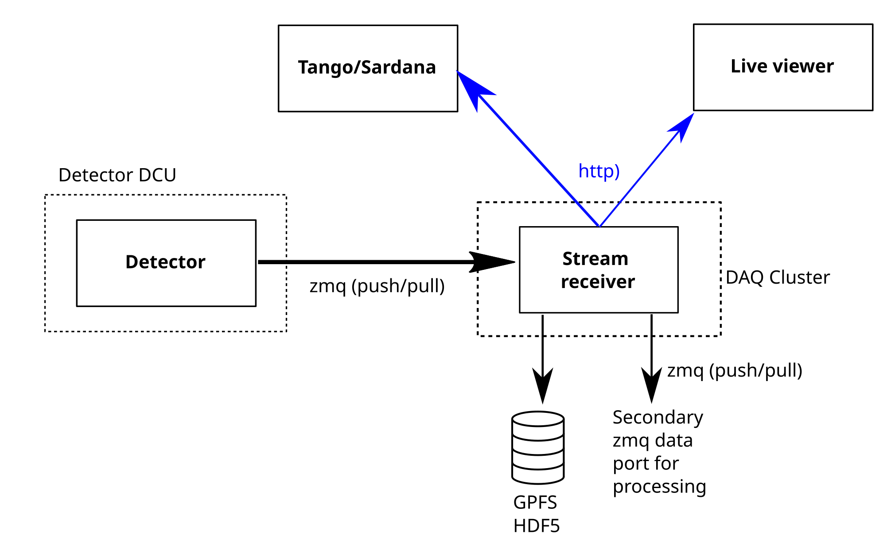

## Streaming receiver
Provides receivers to store data from detectors into HDF5 Files and optional parallel data transformation and processing. Also forwards data on "secondary zmq port" for arbitrary processing.

Receivers for the following detectors:
 - Dectris Eiger 
 - Dectris Pilatus with frame ordering and cbf -> bitshuffle lz4 compression
 - Andor Zyla
 - Hamamatsu Orca Lightning
 - Xspectrum Lambda 


## Run
### Configuration
The configuration of the different detector is stored in the [detectors.yaml](detectors.yaml) file.

### Native
```
streaming-receiver detectors.yaml nanomax-eiger

```
### Docker
Docker image are automatically created in the gitlab CI when a new release is tagged. Docker compose files are provided for the different detectors and beamlines


## DAQ overview


### Http interface

The streaming-receiver has a http rest interface to get the status, number of received frames and most revent frame for live viewing. The api is build with fastapi and has an autogenerated OpenAPI documentation

## Secondary zmq data port for live processing
The Secondary zmq data port for live processing is a **zmq PUSH** socket.

There are 3 different types of messages. The **header** message comes once at the start of the scan, followed by the **image** messages and a final **series_end** message at the end of the scan. The messages are json encoded.
The msg_number field in the messages is a monotonic increasing values that helps to appropriately order the messages

### header message
```json
{
    "htype", "header",
    "msg_number", 0,
    "filename", "/tmp/testfile.h5"
}
```

### image message 
is a multipart zmq message with 2 parts. First part is a json header
```json
{
    "htype", "image",
    "msg_number", 1,
    "frame": 0,
    "shape": (100, 100),
    "type": "uint32",
    "compression", "bslz4"
}
second part is the binary blob of the array with the above description
```
compression can be:
* "bslz4" (bitshuffle lz4 compression)
* "none"

### series_end message
```json
{
    "htype", "series_end",
    "msg_number", 2
}
```

### Example code
Here is some sample python code how to read the seconday zmq stream

```python
import zmq
import json
import time
import numpy as np
from bitshuffle import decompress_lz4

hostname = 'localhost'
context = zmq.Context()
pull = context.socket(zmq.PULL)
pull.connect('tcp://%s:9999' %hostname)
while True:
    parts = pull.recv_multipart(copy=False)
    header = json.loads(parts[0].bytes)
    print(header)
    if header['htype'] == 'image':
        if header['compression'] == 'bslz4':
            img = decompress_lz4(parts[1].buffer, 
                                 header['shape'], 
                                 np.dtype(header['type']))
        else:
            img = np.frombuffer(parts[1], dtype=header['type'])
            img = img.reshape(header['shape']
```
